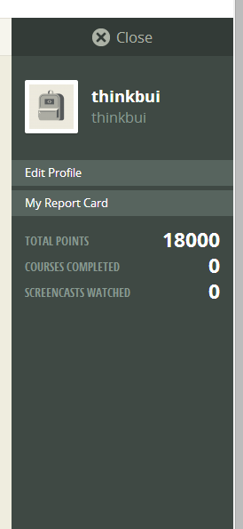

#### Include an inline screenshot of your codeschool's points from the profile page:

<!-- Modify the Markdown to include your answers. Don't delete the questions! -->

##QUIZ
* Explain which tabs support the following actions and how.
  * Realtime editing of HTML and CSS 
	* Edits for both can be done in both the Elements and Sources tab.  Elements offers a DOM view of the code while Sources offers a raw text view of the files.
  * Javascript Debugging
	* Console can be used to trace errors as it gives details on what methods caused the error while Sources can be used to edit the JS code as with HTML and CSS.
  * Performance Optimization 
	* Performace Optimization can be done using the breakdown of the loading/execution statistics in the Network tab, but edits to optimize the performance would be done in the Sources and Elements tabs.

* What's the quick key for your OS to spawn the Dev Tools inspector?
	* For Windows 7, it is Ctrl + Shift + I.

* Go to http://www.postmachina.com/ and analyze and tweak this nicely designed page.
  * What is the current background color for the page?  (Surprisingly, it's not just black!)
	* It is #0b0f11.
  * Tweak the background color to white.
	* See screenshot
  * Tweak the height of the side bar that contains the logo.  Shrink it down to 85px.
	* Directions are ambiguous.  It could be interpreted as the whole sidebar div instead of the sidebar element that contains just the image
  * Roll over the navigation links.  When you hover over them, they dissapear.  Let's change the hover color to black instead.
	* See screenshot
  * Now take a screenshot of your new (and maybe not so improved) design.  It should match this screenshot: http://postimg.org/image/5ak1jkpl5/
  * Upload your own image to the web using an image hosting service.  It should match the image above. The last nav link in the image above is black because the mouse was hovering there when the screenshot was taken. Do the same, and don't take a screenshot of your whole desktop, just the browser window. (This is part of the challenge.)
	* Image below is hosted on external site, but copy is in imgs folder.
	* https://scontent-b-ord.xx.fbcdn.net/hphotos-prn1/t31.0-8/10285832_10203736416754738_7529840577475154226_o.jpg

* For the postmachina website, why can't you tweak the color of the text "The most important things are not things"?  Please explain.
	* The text that is seen is actually part of the background image of the div element.  Though there is text inside a p tag, that text is offset by such a wide margin to hide it from view.

* Go to www.ticketswizard.com and analyze the page.  
  * What is the largest image on the website? 
	* 92624182-c482-4a35-8da2-4fbf2f502e94_Large_Large.png
  * Explain how you would find out this information, and list the URL of offending image here and how big it is.
	* The Network tab lists the statistics of loading the page.  The list can be sorted by the file size.  The URL is http://www.ticketswizard.com/Images/Catalog/92624182-c482-4a35-8da2-4fbf2f502e94_Large_Large.png.  The size is 316 KB.

* Test the www.ticketswizard.com website with google's [PageSpeed Insights](http://www.ticketswizard.com/).  (You can also download the chrome plugin).  What is the lowest hanging fruit to optimize the website?  How many kilobytes of data can be eliminated?
	* sbx.png can be compressed to save 79.2 KB.  All images being compressed could save 885.9 KB.